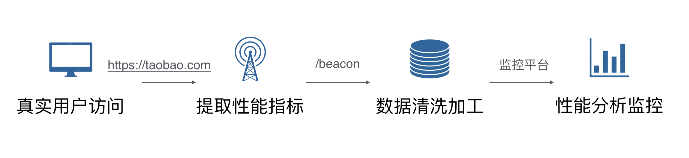
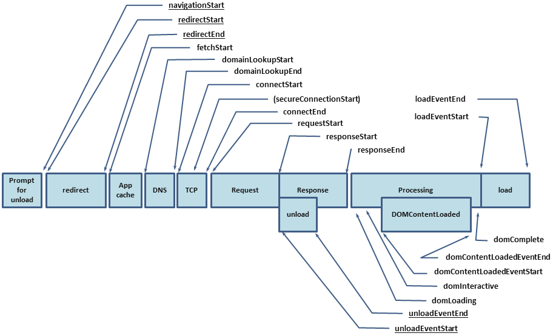
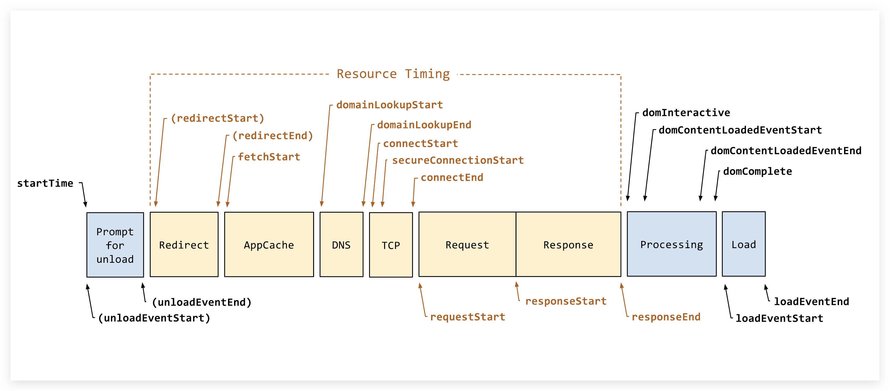

# PerformanceMonitor

## 真实用户性能数据采集方案（RUM）



- 使用标准的 API；
- 定义合适的指标；
- 采集正确的数据；
- 上报关联的维度;


## 数据统计

### FP&FCP

```javascript
// 获取FP/FMP
function getPaint() {
  var paintData = {};
  var p =
    window.performance ||
    window.webkitPerformance ||
    window.msPerformance ||
    window.mozPerformance;
  if (p && p.getEntriesByType) {
    var pobj = {};
    performance.getEntriesByType("paint").forEach(function(e) {
        pobj[e.name] = e.startTime
    });
    paintData.firstpaint = pobj["first-paint"];
    paintData.firstcontentpaint = pobj["first-contentful-paint"]
  }
  return paintData;
}
```


### LongTask

```

```


### Performance Timing

https://www.w3.org/TR/navigation-timing/



1. **domLoading** 表示开始解析第一批收到的 HTML 文档的字节
2. **domInteractive** 表示完成全部 HTML 的解析并且 DOM 构建完毕
3. **domContentLoaded** 表示 [DOM 与 CSSOM 皆已准备就绪](http://calendar.perfplanet.com/2012/deciphering-the-critical-rendering-path/)
   - 如果没有解析器阻塞 JavaScript，*DOMContentLoaded* 事件会在 *domInteractive* 之后立即触发
   - 很多 JavaScript 框架会在执行它们自己的逻辑前等待这个事件的触发
4. **domComplete** 表示所有的处理都已完成并且所有的附属资源都已经下载完毕
5. **loadEvent** 作为网页加载的最后一步以便触发附加的应用逻辑




```
0"navigationStart",
1"unloadEventStart",
2"unloadEventEnd",
3"redirectStart",
4"redirectEnd",
5"fetchStart",
6"domainLookupStart",
7"domainLookupEnd",
8"connectStart",
9"secureConnectionStart",
10"connectEnd",
11"requestStart",
12"responseStart",
13"responseEnd",
14"domLoading",
15"domInteractive",
16"domContentLoadedEventStart",
17"domContentLoadedEventEnd",
18"domComplete",
19"loadEventStart",
20"loadEventEnd",
21"msFirstPaint",
```

```js
let times = {};
let t = window.performance.timing;

// 卸载时间
times.t_unload = t.unloadEventEnd - t.unloadEventStart;
// 重定向时间
times.t_redirect = t.redirectEnd - t.redirectStart;
// dns缓存时间
times.t_appcache = t.domainLookupStart - t.fetchStart;
// dns查询时间
times.t_dns = t.domainLookupEnd - t.domainLookupStart;
// tcp时间
times.t_tcp = t.connectEnd - t.connectStart;
// ssl时间 (https)
times.t_ssl = t.connectEnd - t.secureConnectionStart;
// ttfb(发出页面请求到接收到应答数据第一个字节所花费的毫秒数)
times.t_ttfb = t.responseStart - t.requestStart;
// contentdownload(页面下载时间)
times.t_contentdownload = t.responseEnd - t.responseStart;
// domparsing 浏览器已经解析好DOM树所需时间
times.t_domparsing = t.domInteractive - t.responseEnd;
// res
times.t_res = t.loadEventStart - t.domContentLoadedEventEnd;

// others
// firstbyte
times.t_firstbyte = t.responseStart - t.fetchStart;
// tti
times.t_tti = t.domInteractive - t.fetchStart;
// domready
times.t_domready = t.domContentLoadedEventEnd - t.fetchStart;
// load
times.t_load = t.loadEventStart - t.fetchStart;
// total
times.t_total = t.loadEventEnd - t.fetchStart;

```


### Device Info

| 参数            | 说明       |
| --------------- | ---------- |
| device_id       | 设备id     |
| app_id          | 应用id     |
| app_ver         | 应用版本号 |
| app_ver_name    | 应用版本名 |
| os_ver          | 系统版本号 |
| os_type         | 系统类型   |
| screen_width    | 屏幕宽度   |
| screen_height   | 屏幕高度   |
| device_category | 设备类型   |
| device_model    | 设备模型   |
| lang            | 系统语言   |
| manufacturer    | 制造商     |
| beyla_id        | 贝拉id     |

```javascript
var deviceInfo = {};
if (window.shareitBridge && window.shareitBridge.syncInvoke) {
    var info = window.shareitBridge.syncInvoke("web", "getDeviceInfo", "");
    if (info && info.responseCode === '0') {
        deviceInfo = info;
    }
}
```


### Location Info

| 参数          | 说明                      |
| ------------- | ------------------------- |
| responseCode  | 状态码（0，<0）           |
| sCountryCode  | 根据系统获取的国家码      |
| aCountryCode  | 用户在app中设置的国家码   |
| aProvinceCode | 用户在app中设置的邦(省)码 |
| aCity         | 用户在app中设置的城市     |
| lCountryCode  | 定位的国家码              |
| lProvinceCode | 定位的省份码              |
| lCity         | 定位的城市                |

```javascript
var locationInfo = {};
if (window.shareitBridge && window.shareitBridge.syncInvoke) {
    var info = window.shareitBridge.syncInvoke("web", "getLocationInfo", "");
    if (info && info.responseCode === '0') {
        locationInfo = info;
    }
}
```


### Network Status

```js
var networkStatus = '';
if (window.shareitBridge && window.shareitBridge.syncInvoke) {
    var status = window.shareitBridge.syncInvoke("web", "getNetworkStatus", "");
    if (status && status.responseCode === '0') {
        networkStatus = status.networkStatus;
    }
}

if (!networkStatus && navigator.connection && navigator.connection.effectiveType) {
    networkStatus = navigator.connection.effectiveType;
}
```


### Basic Data

```
var basicData = {};
basicData.url = location.origin + location.pathname;
basicData.query = location.search;
basicData.hash = location.hash.substring(1);
basicData.title = document.title;
basicData.ua = navigator.userAgent;
basicData.s_w = window.screen.width;
basicData.s_h = window.screen.height;

```


### Other Data (优先级低)

1. performance.memory

   **jsHeapSizeLimit**：The maximum size of the heap, in bytes, that is available to the context.

   **totalJSHeapSize**：The total allocated heap size, in bytes.

   **usedJSHeapSize**：The currently active segment of JS heap, in bytes.

2. FPS

3. CPU


## 上报方式

### hybird实时上报接口

```
// 实时上报
const params = {
	event_name: '',
	event_object: '',
}
window.shareitBridge.syncInvoke("web", "statEventNow", JSON.stringify(params))

```


### navigator.sendBeacon 

大部分现代浏览器都支持 navigator.sendBeacon() 方法。这个方法可以用来发送一些统计和诊断的小量数据，特别适合上报统计的场景，具有这样一些优势

- 数据可靠，浏览器关闭请求也照样能发
- 异步执行，不会影响下一页面的加载
- API 使用简单

```js
window.addEventListener('unload', logData, false);

function logData() {
    navigator.sendBeacon("/log", analyticsData);
}
```

### 使用的img标签get请求 (降级使用)

- 没有 Ajax 跨域问题，可做跨域的请求
- 没有浏览器兼容性问题

```js
var i = new Image();
i.onload = i.onerror = i.onabort = function () {
  i = i.onload = i.onerror = i.onabort = null;
}
i.src = url;
```

### 

```js
if (window.navigator && window.navigator.sendBeacon) {
	// sendBeacon
} else {
    // img
}
```


## 上报时机

### onload

### beforeunload

### hashchange

### historystatechange

### visibilitychange/webkitvisibilitychange


## 关键值

### 1.首字节（TTFB）

### 2.DOM Ready

### 3.页面完全加载


## 参考

GA: 

https://www.google-analytics.com/analytics.js

神策：

```js
https://cdn.jsdelivr.net/npm/sa-sdk-javascript@1.15.1/sensorsdata.min.js
```